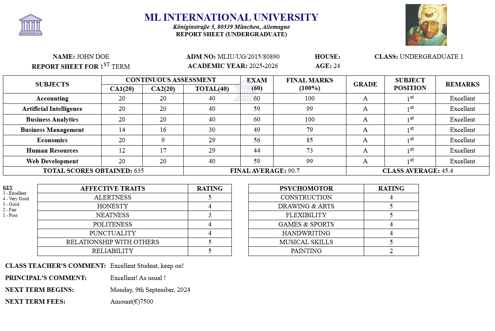

## **Laravel School Management System** 
**This is cloned project from <a href="/4jean/lav_sms">lav_sms</a>
**LAVSMS** is developed for educational institutions like schools and colleges built on Laravel 8

### SCREENSHOTS

#### Dashboard


#### Login


#### Student Marksheet


#### System Settings


#### Print Marksheet
<div style="clear: both"> </div>


#### Print Tabulation Sheet & Marksheet


<hr />  

There are 7 types of user accounts. They include:
 
Administrators (Super Admin & Admin)
- Librarian
- Accountant
- Teacher
- Student
- Parent

**Requirements**
- <a href="https://windows.php.net/download#php-8.3">PHP</a> 8.0 and above
- <a href="https://getcomposer.org/Composer-Setup.exe">Composer</a>
- <a href="https://nodejs.org/dist/v22.13.1/node-v22.13.1-x64.msi">Nodejs + npm</a>
- <a href="https://sourceforge.net/projects/xampp/files/XAMPP%20Windows/8.2.12/xampp-windows-x64-8.2.12-0-VS16-installer.exe">XAMPP</a> for MySQL + PHPMyAdmin

<a href="https://laravel.com/docs/8.x">Check Laravel 8 Requirements</a> for more info.


## **Project Setup & Config**
### Set Database Credentials && App Settings in dotenv file (.env)
Change the following values to match the credentials of your local DB:
```bash
DB_CONNECTION=mysql
DB_HOST=127.0.0.1
DB_PORT=3306
DB_DATABASE=test
DB_USERNAME=root
DB_PASSWORD=
```
**Note**:<br>
The `test` value is an example of a DB name which you have to create first or change the value to an existing DB that should be dedicated only for this project.
<br>

**!! Warning !!**: IF THERE'S AN EXISTING DB, MAKE SURE IT IS COMPLETELY EMPTY BEFORE SETTING IT AS A DB FOR THE PROJECT !!

<hr>

### Install dependencies 
```bash
composer install
```

### Generate local App key
```bash
php artisan key:generate
```

### Migrate Database
<b>Important Note:</b>
This will effect on the seeding of the assets in the DB which depends on the `APP_URL`
<br>
By default, PHP runs on port 8000 on localhost that's why the `APP_URL` key is set to `127.0.0.1:8000` in `.env` assuming that the project will be launched using artisan command.<br>
<b>If you run the project using `artisan`</b><br>
Come back to this note in case there is no response after running `php artisan serve`.<br>
If it runs on another port like 8001, change the 8000 (APP_URL key in the `.env` file) to the port value that it runs with (in this example change 127.0.0.1:8000 to 127.0.0.1:8001).<br><br>

<b>If you run the project using `XAMPP`</b><br>
In `.env`, comment the following line by adding `#` in the beginning
```bash
APP_URL=127.0.0.1:8000
```
and remove the `#` from the beginning of  
```bash
#APP_URL= http://localhost/public #if using XAMPP
```

<br>Once the `APP_URL` is set up, run the migration<br>


```bash
php artisan migrate
```

### Database seed
```bash
php artisan db:seed
```
<hr>

### Run project
**It's <u>recommended</u> to run the project using**
```bash
php artisan serve
```

### Automate the migration, seeding
by running the following script
```bash
bash setup-db.sh
```
**But if you want to run the app using XAMPP:**
1) Place the project directory in the `xampp/htdocs/` folder 
2) run XAMPP control panel
3) Type `localhost` in url bar, if you get an `Index of` directory as a response
4) You should get this page<br>


<br>

### Login Credentials
After seeding. Login details as follows:

| Account Type  | Username  | Email               | Password  |
| ------------- | --------- | ------------------- | --------- |
|  Super Admin  | sysAdmin  | sys.admin@mliu.com  |     cj    |
|  Admin        | admin     | admin@mliu.com      |     cj    |
|  Teacher      | teacher   | teacher@mliu.com    |     cj    |
|  Parent       | parent    | parent@example.com  |     cj    |
|  Accountant   | accountant| accountant@mliu.com |     cj    |
|  Student      | student   | student@mliu.com    |     cj    |

### FUNCTIONS OF ACCOUNTS 

#### SUPER ADMIN
- Only Super Admin can delete any record
- Create any user account
- Has full access and control over the system

#### Administrators (Super Admin & Admin)
- Manage students class/sections
- View marksheet of students
- Create, Edit and manage all user accounts & profiles (except Super Admin)
- Create, Edit and manage Exams & Grades
- Create, Edit and manage Subjects
- Manage noticeboard of school
- Notices are visible in calendar in dashboard
- Edit system settings
- Manage Payments & fees

#### ACCOUNTANT
- Manage Payments & fees
- Print Payment Receipts

#### LIBRARIAN
- Manage Books in the Library (not completed)

#### TEACHER
- Manage Own Class/Section
- Manage Exam Records for own Subjects
- Manage Timetable if Assigned as Class Teacher
- Manage own profile
- Upload Study Materials(not completed)

#### STUDENT
- View teacher profile
- View own class subjects
- View own marks and class timetable
- View Payments
- View library and book status
- View noticeboard and school events in calendar
- Manage own profile

#### PARENT
- View teacher profile
- View own child's marksheet (Download/Print PDF)
- View own child's Timetable
- View own child's payments
- View noticeboard and school events in calendar
- Manage own profile

<br>

<b>Please Note</b> that some sections of this project are in the work-in-progress stage and would be updated soon. These include:

- The Noticeboard/Calendar in the Dashboard Area
- Librarian/Acountant user pages
- Library Resources/Study Materials Upload for Students
